# Algoritmos desarrollados en Visual Basic.NET

Instituto Profesional de Educación Comunitaria  
:house: IPEC Santo Domingo de Heredia  
Autor: Jesús Alberto Moscoso Agüero  
:v: J. Mosro  
:email: jmosro.14@gmail.com  
2021  
:costa_rica:  

## [**Proyecto Ejercicios Sencillos**](EjerciciosSencillos/) :label:  

Ejercicios resueltos en lenguaje Visual Basic.NET con base en recursos Web realizados por otras personas. Desarrollo en GTA - Guías de Trabajo Autónomo del 2021 para trabajo en clase y casa. Subárea: Programación, del tercer año. Carrera: Técnico Medio en Informática en Desarrollo de Software. Temática: Ejercicios básicos de Visual Basic.  

`Ejercicios Sencillos - Menú.`  
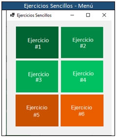  
`Ejercicios Sencillos - Ejercicio 1.`  
`Se requiere de un programa que permita el ingreso de N números enteros mayores a 0 y realice la sumatoria de los números ingresados, el programa debe finalizar al ingresar 0.`  
`Fuente: https://youtu.be/tu1ISB77Myk Canal: Sistematts. Descripción: VÍDEO #8 - EJERCICIOS BÁSICOS EN VISUAL BASIC - PARTE 1(WINDOWS FORMS).`  
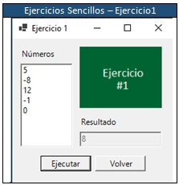  
`Ejercicios Sencillos - Ejercicio 2.`  
`Se requiere de un programa que permita el ingreso de un número y muestre en pantalla las tablas de multiplicar.`  
`Fuente: https://youtu.be/tu1ISB77Myk Canal: Sistematts. Descripción: VÍDEO #8 - EJERCICIOS BÁSICOS EN VISUAL BASIC - PARTE 1(WINDOWS FORMS)`  
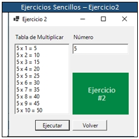  
`Ejercicios Sencillos - Ejercicio 3.`  
`Se requiere de un programa que calcule el área del triángulo, cuadrado, rectángulo y rombo.`  
`Fuente: https://youtu.be/HNO2NyndsjE Canal: Sistematts. Descripción: VÍDEO #9 - EJERCICIOS BÁSICOS EN VISUAL BASIC - PARTE 2(WINDOWS FORMS)`  
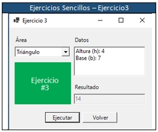  
`Ejercicios Sencillos - Ejercicio 4.`  
`Se requiere de un programa que permita el ingreso de N de estudiantes y un N de notas y calcule el promedio de cada estudiante.`  
`Fuente: https://youtu.be/HNO2NyndsjE Canal: Sistematts. Descripción: VÍDEO #9 - EJERCICIOS BÁSICOS EN VISUAL BASIC - PARTE 2(WINDOWS FORMS)`  
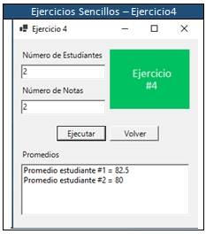  
`Ejercicios Sencillos - Ejercicio 5.`  
`Crear un vector de 5 posiciones, cargue esas cinco posiciones con nombres de personas, cree una opción de buscar nombre y recorra el vector en las cinco posiciones, si encuentra el nombre que lo indique, sino que diga valor no encontrado.`  
`Fuente: https://youtu.be/wxeaZ3kROR8 Canal: Sistematts. Descripción: VÍDEO #10 - VECTORES O ARREGLOS UNIDIMENSIONALES EN VISUAL BASIC(WINDOWS FORMS)`  
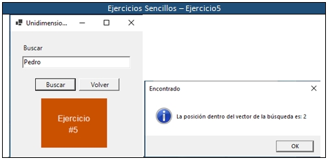  
`Ejercicios Sencillos - Ejercicio 6.`  
`Crear una matriz de 3x3 posiciones, donde inserte números e indique cuál es el mayor.`  
`Fuente: https://youtu.be/P69F7co8O-M Canal: Sistematts. Descripción: VÍDEO #11 - VECTORES O MATRICES MULTIDIMENSIONALES EN VISUAL BASIC(WINDOWS FORMS)`  
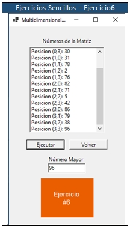  

## [**Proyecto POO Ejercicio 1**](POOEjercicio1/) :label:  

Ejercicios resueltos en lenguaje Visual Basic.NET con base en recursos Web realizados por otras personas. Desarrollo en GTA - Guías de Trabajo Autónomo del 2021 para trabajo en clase y casa. Subárea: Programación, del tercer año. Carrera: Técnico Medio en Informática en Desarrollo de Software. Temática: Ejercicios básicos de Visual Basic.  

`Crear un programa para ingresar o retirar dinero de una cuenta titular.`  
`Fuente: https://youtu.be/UXSmop6dA68 Canal: DiscoDurodeRoer. Descripción: Ejercicios Visual Basic .NET - POO #1 - Cuenta de ahorro.`  
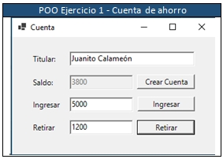  

## [**Proyecto POO Ejercicio 2**](POOEjercicio2/) :label:  

Ejercicios resueltos en lenguaje Visual Basic.NET con base en recursos Web realizados por otras personas. Desarrollo en GTA - Guías de Trabajo Autónomo del 2021 para trabajo en clase y casa. Subárea: Programación, del tercer año. Carrera: Técnico Medio en Informática en Desarrollo de Software. Temática: Ejercicios básicos de Visual Basic.  

`Crear un programa para generar password y determinar si es un password fuerte.`  
`Fuente: https://youtu.be/Z8Uvk9A0XQY Canal: DiscoDurodeRoer. Descripción: Ejercicios Visual Basic .NET - POO #3 - Clase Password.`  
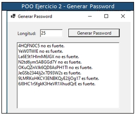  

## [**Proyecto prObjetosClases**](prObjetosClases/) :label:  

Ejercicios resueltos en lenguaje Visual Basic.NET con base en recursos Web realizados por otras personas. Desarrollo en GTA - Guías de Trabajo Autónomo del 2021 para trabajo en clase y casa. Subárea: Programación, del tercer año. Carrera: Técnico Medio en Informática en Desarrollo de Software. Temática: Ejercicios básicos de Visual Basic.  

`Crear un programa para demostrar el uso del objeto Perro.`  
`Fuente: https://youtu.be/zt29PaBvyTw Canal: Juan Carlos Arcila Díaz. Descripción: Clases y Objetos POO (23-25) Programación en Visual Basic Net con Visual Studio 2013.`  
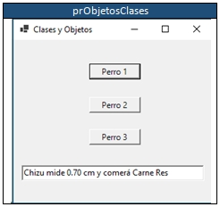  

## [**Proyecto prHerenciaPolimorfismo**](prHerenciaPolimorfismo/) :label:  

Ejercicios resueltos en lenguaje Visual Basic.NET con base en recursos Web realizados por otras personas. Desarrollo en GTA - Guías de Trabajo Autónomo del 2021 para trabajo en clase y casa. Subárea: Programación, del tercer año. Carrera: Técnico Medio en Informática en Desarrollo de Software. Temática: Ejercicios básicos de Visual Basic.  

`Crear un programa para demostrar el uso de la herencia en Empleado.`  
`Fuente: https://youtu.be/d0Z1yDovLYc Canal: Juan Carlos Arcila Díaz. Descripción: Herencia y Polimorfismo POO (24-25) Programación en Visual Basic Net con Visual Studio 2013.`  
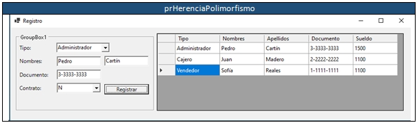  

---
